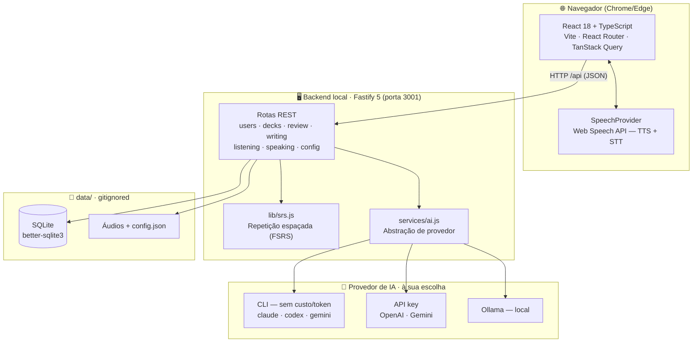

<p align="center">
  
</p>

<h1 align="center">Mynah</h1>

<p align="center">
  
  
  
  
  
  
  
  
</p>

> Seu tutor de inglês local, feito para destravar o inglês em 90 dias — com a IA que **você** já tem.
>
> *(O mainá é o pássaro que aprende a falar imitando — a metáfora do método: ouvir, repetir, produzir.)*

Mynah é um aplicativo **local** (roda na sua máquina) para praticar inglês
seguindo um plano de 90 dias baseado em **input compreensível + prática de output**
(ouvir, vocabulário, fala e escrita). Ele se conecta a uma IA da sua escolha
(Claude, GPT, Gemini ou modelos locais via Ollama) para gerar exercícios, corrigir
sua escrita e conversar com você como um tutor.

Multiusuário (ideal pra casal/família), sem nuvem, seus dados ficam num SQLite local.

---

## 📸 Telas

<!--
  Para preencher: rode o app, tire prints e salve em docs/screenshots/ com estes nomes.
  Sugestão de captura em docs/screenshots/README.md.
-->

|  |  |
|---|---|
|  |  |
| **🏠 Dashboard** — dia, fase, streak e os 4 blocos | **🗂️ Vocabulário** — revisão FSRS com áudio |
|  |  |
| **🎧 Ouvir** — diálogos narrados em 2 vozes | **🗣️ Fala** — shadowing (nota 0–100%) e tutor |

---

## ✨ Funcionalidades

- 🏠 **Dashboard do plano de 90 dias** — dia atual, fase, streak 🔥 (com **freezes 🧊** ganhos a cada semana completa), foco sugerido, marcos (Dia 7, 30, 45, 60, 90) e o painel **"seus erros recorrentes"**.
- 🗂️ **Vocabulário com FSRS** — o agendador moderno do Anki (~25% menos revisões que o SM-2 clássico para a mesma retenção). Cards são **frases inteiras em contexto**, com áudio — nunca palavras soltas. Revisão com **4 modos intercalados**: traduzir, ✂️ completar a lacuna, 🇧🇷→🇬🇧 produzir a frase e 👂 só de ouvido.
- 🎧 **Listening** — diálogos gerados no seu nível narrados com **duas vozes** (pausar/retomar/parar), e **YouTube com transcrição sincronizada**: legenda acompanha o vídeo, **clicar em qualquer frase pula o vídeo para aquele momento**, **tradução do vídeo inteiro guardada no banco** (reabrir é instantâneo e não gasta IA), **nível CEFR estimado do vídeo** com aviso quando foge do seu, **tradutor do navegador como rede de segurança** se a IA cair (marcado com ⚠️ e reescrito depois), "+ card" direto da fala e **canais favoritos** (cole o canal — ou um vídeo dele — e busque só dentro dos seus).
- 📖 **Leitura extensiva** — textos gerados no seu nível com **lookup de 1 clique** (o significado da palavra *naquela frase*) e mineração de frases para o baralho, estilo LingQ.
- ✅ **Checagem de compreensão** — diálogos e textos vêm com 3 perguntas opcionais (geradas na mesma chamada, sem custo extra) para combater a “escuta/leitura passiva”.
- 🗣️ **Fala** — **Shadowing** com nota 0–100%, **Tutor de conversa** por voz ou texto, **🎭 Roleplay com objetivo** (cenário com meta concreta + avaliação por rubrica no final) e **4·3·2** (a mesma história 3× com menos tempo — fluência na marra).
- ✍️ **Escrita com correção por IA** — texto corrigido, erros explicados em PT (e **categorizados num banco de erros** que realimenta o tutor e o corretor), versão mais natural e comentário.
- 🎯 **Teste de nivelamento** — ~8 min, adaptativo, em três partes (vocabulário com palavras-armadilha inventadas, escuta narrada pelo próprio navegador, e lacunas em contexto). Banco de itens fixo e curado, **sem IA** — um modelo escrevendo as questões também estaria decidindo o que é "B2". O resultado **sugere**, você decide. As perguntas de compreensão do dia a dia viram evidência contínua e sugerem ajuste com o tempo.
- 📈 **Nível dinâmico (i+1)** — a dificuldade do conteúdo gerado sobe (CEFR A2→C1) conforme seu desempenho real em cards, escrita e fala.
- 👥 **Perfis** — seletor estilo "Netflix" (sem senha), progresso e conteúdo separados por pessoa (com checagem de dono na API). **Metas diárias configuráveis** por perfil.
- 🎨 **Tema claro/escuro/auto** + ajuda contextual (❓ em cada tela) + validação de idioma (se você escrever em português onde é pra treinar inglês, o app avisa — antes de gastar IA).
- 🤖 **IA trocável** — escolha o provedor nas configurações (veja abaixo). O painel avisa se a IA não está respondendo.
- 🔒 **100% local** — SQLite + arquivos de áudio na pasta `data/`. Nada é enviado para a nuvem além das chamadas à IA que você configurou.

## 🤖 IAs suportadas

Você escolhe o provedor nas Configurações. Há opções **via CLI** (cobertas pela sua
assinatura/conta — sem custo por token) e **via API** (chave, cobrado por token):

| Provedor | Como funciona | Custo | Requisito |
|---|---|---|---|
| **Claude Code (Max)** | CLI `claude -p` headless | Coberto pela assinatura Max | [Claude Code](https://claude.com/product/claude-code) instalado e logado |
| **OpenAI Codex (CLI)** | CLI `codex exec --json` | Coberto pelo ChatGPT Plus/Pro | `npm i -g @openai/codex` + `codex login` |
| **Google Gemini (CLI)** | CLI `gemini -p` | Grátis (conta Google, ~1.000 req/dia) | `npm i -g @google/gemini-cli` + login |
| **Ollama** | Modelos locais | Grátis / offline | [Ollama](https://ollama.com) rodando |
| **OpenAI (API key)** | API Chat Completions | Pago por token | Chave de API |
| **Gemini (API key)** | API Generative Language | Tier grátis + pago | Chave de API |
| ~~GitHub Copilot~~ | — | — | **Não suportado**: sem API pública de chat de uso geral para terceiros |

O **sistema operacional é detectado automaticamente** (Windows/macOS/Linux) — não é preciso selecioná-lo.

## 🛠️ Stack

- **Backend:** Node.js (ESM) + [Fastify 5](https://fastify.dev) + [better-sqlite3](https://github.com/WiseLibs/better-sqlite3), com [OpenAPI/Swagger](https://swagger.io) em `/docs`
- **Frontend:** [React 18](https://react.dev) + [TypeScript](https://www.typescriptlang.org) (strict) + [Vite 6](https://vite.dev), [React Router](https://reactrouter.com) e [TanStack Query](https://tanstack.com/query)
- **Áudio:** Web Speech API do navegador (TTS + reconhecimento de voz) — grátis, **funciona melhor no Chrome/Edge**
- **Qualidade:** [ESLint](https://eslint.org) + [Prettier](https://prettier.io), testes com [Vitest](https://vitest.dev) e CI no [GitHub Actions](.github/workflows/ci.yml) (lint + typecheck + testes + build)

## 🏗️ Arquitetura

Tudo roda na sua máquina. O front (SPA) fala com a API local por HTTP; a API despacha
as chamadas de IA para o **provedor que você escolher** através de uma camada de abstração.



## 📋 Pré-requisitos

- **Node.js 20+**
- **Chrome ou Edge** (para o áudio: ouvir e falar)
- **Uma IA** configurada — pelo menos uma das opções da tabela acima

## 🚀 Instalação e execução

```bash
git clone https://github.com/diegoortega15/mynah.git && cd mynah
npm install && npm run install:all
npm run dev
```

Pronto — o `npm run dev` sobe o backend (`:3001`) e o frontend (`:5173`) juntos.
Abra **https://localhost:5173** no Chrome ou Edge. Como o Vite usa um certificado
autoassinado, o navegador mostra um aviso de segurança na primeira vez — clique em
**Avançado → Prosseguir**.

> 💡 **Quer testar sem IA?** Rode `npm run seed` antes: cria um perfil "Demo" com um
> baralho de 12 frases e um diálogo estáticos — revisão e listening funcionam sem
> configurar provedor nenhum. (Todo perfil novo também já nasce com o baralho
> **"Primeiros passos"**.)

<details>
<summary>Opções avançadas (rodar separado, HTTP, banco)</summary>

- **Terminais separados:** `cd server && npm start` e `cd web && npm run dev`.
- **Sem HTTPS** (o microfone só funciona em localhost): `NO_SSL=1 npm run dev` dentro de `web/`.
- **Caminho do banco:** variável `DB_PATH` (padrão `data/fluencylab.db`; os testes usam `:memory:`).
- **Porta da API:** variável `PORT` no server — lembre de ajustar o proxy em `web/vite.config.js`.

</details>

## 📱 Acessar pelo celular (mesma rede Wi-Fi)

O Vite já sobe em HTTPS e exposto na rede local, então dá para estudar pelo celular:

1. Celular e computador na **mesma rede Wi-Fi**.
2. Descubra o IP do PC (`ipconfig` no Windows → IPv4, ex: `192.168.0.10`).
3. No Windows, permita o Node no **firewall** (redes privadas) na primeira execução.
4. No Chrome do celular, abra **`https://SEU_IP:5173`** e aceite o aviso de certificado.

O HTTPS é necessário para o **microfone** (Shadowing e Tutor por voz) funcionar fora
do `localhost` — navegadores bloqueiam o microfone em conexões não seguras.

## ⚙️ Configuração da IA

Por padrão o app usa o **Claude Code (Max)**. Para trocar:

1. Abra o app → clique no seu **perfil** (canto superior direito) → **⚙️ Perfil**.
2. Na seção **🤖 Inteligência Artificial**, escolha o provedor.
3. Preencha os campos (chave de API, modelo, etc.) e clique em **Testar conexão** → **Salvar IA**.

As configurações (incluindo chaves de API) ficam em `data/config.json`, que é
**ignorado pelo Git** — suas chaves nunca vão para o repositório.

## 📁 Estrutura

```
mynah/
├─ server/                 # API Fastify (Node ESM)
│  ├─ app.js               # buildApp() — plugins + rotas (testável via app.inject)
│  ├─ index.js             # bootstrap (listen)
│  ├─ db.js  schema.sql    # SQLite + migrações idempotentes
│  ├─ config.js            # config da IA (data/config.json)
│  ├─ lib/                 # srs.js (FSRS), streak.js (freeze), level.js (i+1), errorBank.js…
│  ├─ services/
│  │  ├─ ai.js             # camada de IA (despacha para o provedor)
│  │  └─ providers/        # claudeCli, codexCli, geminiCli, ollama, openai, gemini
│  ├─ routes/              # users, decks, review, writing, listening, speaking, reading, config, history, progress
│  └─ test/                # Vitest (FSRS, streak, extractJson, rotas via app.inject em :memory:)
├─ web/                    # frontend React + TypeScript + Vite
│  └─ src/
│     ├─ api.ts queries.ts types.ts     # API tipada, hooks de dados, tipos de domínio
│     ├─ useSpeech.ts speech-types.ts   # TTS/STT (Web Speech API)
│     ├─ hooks/useRecorder.ts           # câmera + MediaRecorder
│     ├─ features/speaking/             # Shadowing, Tutor, Roleplay, FourThreeTwo, RecordSelf
│     └─ *.tsx                          # telas (Dashboard, Vocab, Listening, Writing, Settings…)
├─ assets/                 # logo/ícone (Mynah)
├─ data/                   # SQLite + áudios + config.json  (gitignored)
├─ docs/                   # IMPROVEMENTS.md, screenshots/
├─ PLANO.md                # o plano de desenvolvimento
└─ README.md
```

## 🔐 Dados e privacidade

- Tudo roda localmente. O banco (`data/fluencylab.db`) e as configurações não saem da sua máquina.
- As únicas requisições externas são as **chamadas à IA que você escolheu** (ou nenhuma, se usar Ollama offline).
- Chaves de API ficam apenas em `data/config.json` (gitignored).

## 🗺️ Roadmap

Já implementado: FSRS + 4 modos de revisão, leitura extensiva com lookup, roleplay
com rubrica, técnica 4·3·2, nível dinâmico (i+1), banco de erros recorrentes, streak
com freeze, metas configuráveis, tema claro/escuro, gravar-se em vídeo com feedback
da IA, YouTube com transcrição sincronizada, histórico (heatmap), ajuda contextual.
O plano completo das rodadas de melhoria está em `docs/IMPROVEMENTS.md` e `docs/ROADMAP-V2.md`.

Backlog:

- [ ] **Análise de pronúncia/sotaque/entonação** (o feedback atual é só de conteúdo, via transcrição). Opções avaliadas:
  - **Azure Pronunciation Assessment** — fonema + fluência + prosódia/entonação; tier grátis (~5h/mês); manda áudio pra nuvem. (Caminho fácil.)
  - **Local grátis com ML** — Whisper + wav2vec2 (fonemas) offline; sem custo, mas backend Python + modelos ~1 GB.
  - **Visualizador de entonação in-browser** — curva de pitch (Web Audio API) vs. referência; 100% local, sem nota de fonema. (Caminho leve.)
- [ ] **Vozes premium (TTS neural)** — ElevenLabs (tier grátis) / OpenAI TTS, como provedor de voz plugável
- [ ] Podcasts reais via RSS (BBC Learning English, TED)

## 📄 Licença

Licenciado sob [MIT](LICENSE).

## 🙌 Créditos

Baseado num plano pessoal de 90 dias para inglês profissional (input compreensível +
output frequente). Feito para uso próprio e de quem quiser aprender junto.
